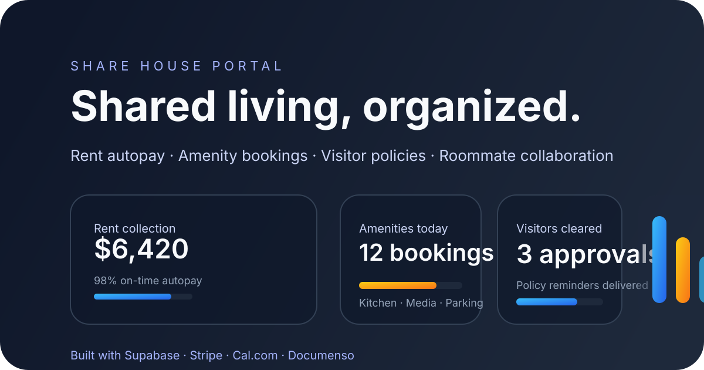

# Share House Portal

Share House Portal is a tenant-facing web experience for properties with shared units. It brings rent collection, amenity reservations, visitor compliance, and roommate collaboration into a single secure workspace so tenants and property managers always share the same source of truth.



## Highlights

- **Rent collection built on Stripe** – split rent by roommate, configure autopay schedules, and reconcile payments with exportable ledgers.
- **Amenity scheduling powered by Cal.com** – embed booking flows for kitchens, lounges, gaming rooms, parking bays, and more with realtime availability rules.
- **Visitor management** – register overnight guests, enforce stay limits, and keep audit trails for property teams and security staff.
- **Roommate collaboration** – realtime message boards, task assignments, and document storage aligned with Supabase Realtime and Documenso workflows.
- **Accessible, responsive marketing site** – light/dark themes, semantic landmarks, and mobile-first layouts tailored for shared living communities.

## Tech stack

| Layer | Technology |
| --- | --- |
| Framework | [Next.js 14 App Router](https://nextjs.org/) + TypeScript |
| Styling | Tailwind CSS + [shadcn/ui](https://ui.shadcn.com/) |
| Data + Auth | [Supabase](https://supabase.com/) (Postgres, Auth, Storage, Realtime) |
| Payments | [Stripe](https://stripe.com/) Checkout & Billing Portal |
| Scheduling | [Cal.com](https://cal.com/) embedded booking widgets |
| Documents | [Documenso](https://documenso.com/) digital signing |
| Deployment | [Vercel](https://vercel.com/) |

## Getting started

1. **Install dependencies**

   ```bash
   pnpm install
   ```

2. **Configure environment variables** – copy `.env.example` if available and provide the following keys:

   ```bash
   NEXT_PUBLIC_SUPABASE_URL="https://YOUR-supabase-url"
   NEXT_PUBLIC_SUPABASE_ANON_KEY="YOUR-anon-key"
   SUPABASE_SERVICE_ROLE_KEY="YOUR-service-role-key"
   NEXT_PUBLIC_APP_URL="http://localhost:3000"
   STRIPE_SECRET_KEY="sk_live_or_test"
   STRIPE_WEBHOOK_SECRET="whsec_..."
   CALCOM_BASE_URL="https://cal.your-domain"
   CALCOM_API_KEY="YOUR-calcom-key"
   DOCUMENSO_BASE_URL="https://docs.your-domain"
   DOCUMENSO_API_KEY="YOUR-documenso-key"
   ```

3. **Run the development server**

   ```bash
   pnpm dev
   ```

   The app is available at [http://localhost:3000](http://localhost:3000).

4. **Run lint checks** (recommended before committing)

   ```bash
   pnpm lint
   ```

## Deployment

Deploy to Vercel using the dashboard or the `vercel` CLI. Configure environment variables in each environment (`development`, `staging`, `production`) and supply Supabase, Stripe, Cal.com, and Documenso credentials. Enable Supabase Row Level Security policies for tenant isolation before going live.

## Project resources

- Tenant handbook: `/resources/tenant-handbook`
- Manager playbook: `/resources/manager-playbook`
- Support center: `/support`

---

Share House Portal is designed to keep roommates, tenants, and property managers aligned without spreadsheets or fragmented tooling. Contributions and feedback are welcome.
